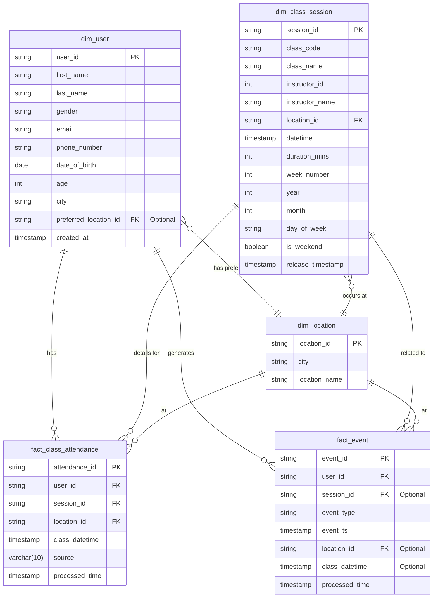

# Data Model Design

This document outlines the design of the data model, including fact tables, dimension tables, and their relationships. This model is designed to support analytics related to class attendance and user events.

## 1. Dimension Tables

Dimension tables provide descriptive context to the fact tables.

### 1.1. `dim_user`

Stores information about users.

| Field Name            | Type        | Description                 |
| --------------------- | ----------- | --------------------------- |
| `user_id`             | string      | Primary Key                 |
| `first_name`          | string      | User's first name           |
| `last_name`           | string      | User's last name            |
| `gender`              | string      | User's gender               |
| `email`               | string      | User's email address        |
| `phone_number`        | string      | User's phone number         |
| `date_of_birth`       | date        | User's date of birth        |
| `age`                 | int         | User's age                  |
| `city`                | string      | City where the user resides |
| `preferred_location_id` | string    | Foreign Key, to `dim_location` (user's preferred location) |
| `created_at`          | timestamp   | Timestamp of user creation  |

### 1.2. `dim_class_session`

Stores information about class schedules and details.

| Field Name          | Type      | Description                            |
| ------------------- | --------- | -------------------------------------- |
| `session_id`        | string    | Primary Key                            |
| `class_code`        | string    | Unique code for the class              |
| `class_name`        | string    | Name of the class                      |
| `instructor_id`     | int       | ID of the instructor                   |
| `instructor_name`   | string    | Name of the instructor                 |
| `location_id`       | string    | Foreign Key, to `dim_location`         |
| `datetime`          | timestamp | Scheduled date and time of the class   |
| `duration_mins`     | int       | Duration of the class in minutes       |
| `week_number`       | int       | Week number of the year                |
| `year`              | int       | Year of the class                      |
| `month`             | int       | Month of the class                     |
| `day_of_week`       | string    | Day of the week (e.g., "Monday")       |
| `is_weekend`        | boolean   | True if the class is on a weekend      |
| `release_timestamp` | timestamp | Timestamp when the class was released  |

### 1.3. `dim_location`

Stores information about different locations/venues.

| Field Name    | Type   | Description              |
| ------------- | ------ | ------------------------ |
| `location_id` | string | Primary Key              |
| `city`        | string | City of the location     |
| `location_name` | string | Name of the location/venue |

## 2. Fact Tables

Fact tables store quantitative data about business events.

### 2.1. `fact_class_attendance`

Records user attendance for classes.

| Field Name       | Type        | Description                                                    |
| ---------------- | ----------- | -------------------------------------------------------------- |
| `attendance_id`  | string      | Primary Key (e.g., hash of `user_id` + `session_id`)           |
| `user_id`        | string      | Foreign Key, references `dim_user.user_id`                     |
| `session_id`     | string      | Foreign Key, references `dim_class_session.session_id`         |
| `location_id`    | string      | Foreign Key, references `dim_location.location_id`             |
| `class_datetime` | timestamp   | Actual time of class attendance (matches `dim_class_session.datetime`) |
| `source`         | varchar(10) | Data source (e.g., "mobile", "web")                            |
| `processed_time` | timestamp   | Timestamp when the record was processed                        |

### 2.2. `fact_event`

Records user interaction events.

| Field Name       | Type      | Description                                               |
| ---------------- | --------- | ------------------------------------------------- |
| `event_id`       | string    | Primary Key                                       |
| `user_id`        | string    | Foreign Key, references `dim_user.user_id`        |
| `session_id`     | string    | Foreign Key, references `dim_class_session.session_id` (if applicable) |
| `event_type`     | string    | Type of event (e.g., "click", "booking", "check-in") |
| `event_ts`       | timestamp | Timestamp of the event                            |
| `location_id`    | string    | Foreign Key, references `dim_location.location_id` (if applicable) |
| `class_datetime` | timestamp | Timestamp of the related class (if applicable)    |
| `processed_time` | timestamp | Timestamp when the record was processed           |

## 3. Table Relationships (Star Schema)

The data model follows a star schema pattern where fact tables are at the center, connected to multiple dimension tables.

**Key Relationships:**

*   **`fact_class_attendance`** is linked to:
    *   `dim_user` on `fact_class_attendance.user_id = dim_user.user_id`
    *   `dim_class_session` on `fact_class_attendance.session_id = dim_class_session.session_id`
    *   `dim_location` on `fact_class_attendance.location_id = dim_location.location_id`

*   **`fact_event`** is linked to:
    *   `dim_user` on `fact_event.user_id = dim_user.user_id`
    *   `dim_class_session` on `fact_event.session_id = dim_class_session.session_id` (This link might be optional depending on the event type)
    *   `dim_location` on `fact_event.location_id = dim_location.location_id` (This link might be optional depending on the event type)

*   **`dim_class_session`** is linked to:
    *   `dim_location` on `dim_class_session.location_id = dim_location.location_id`

*   **`dim_user`** can be linked to:
    *   `dim_location` on `dim_user.preferred_location_id = dim_location.location_id` (Indicates user preference, not necessarily where all their activities occur)

This model allows for flexible querying and analysis of user attendance patterns, event occurrences, and their associated dimensions like user demographics, class details, and location information. 